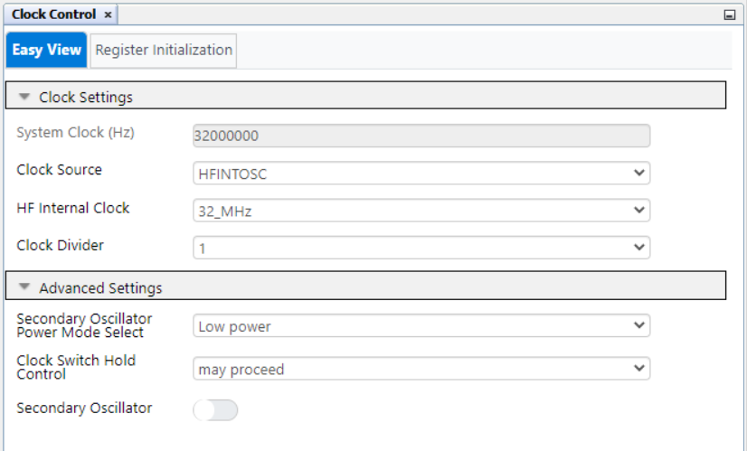
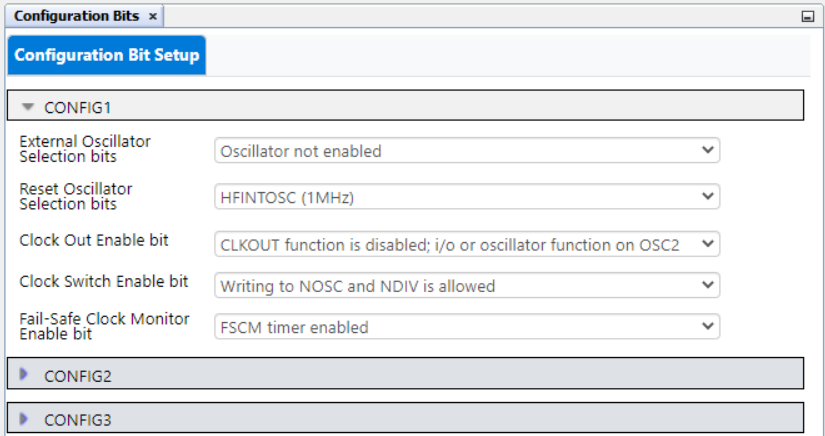
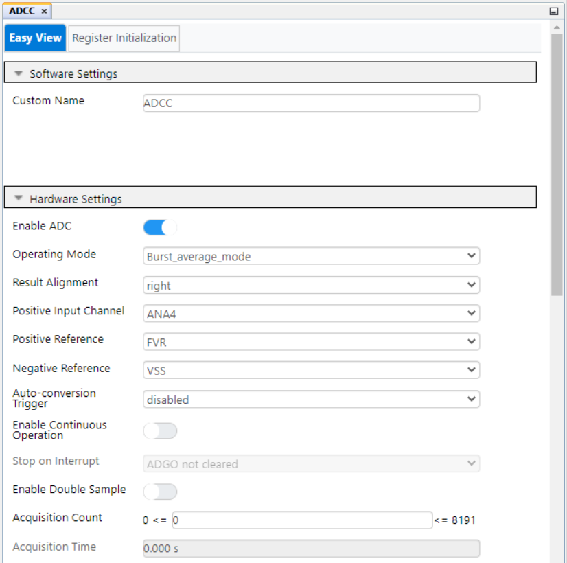
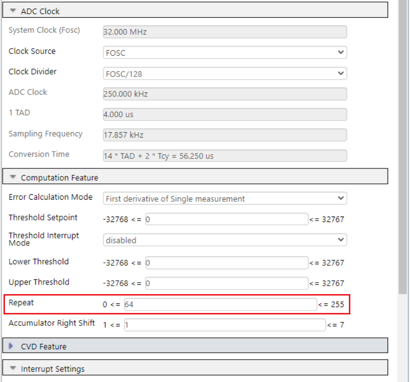
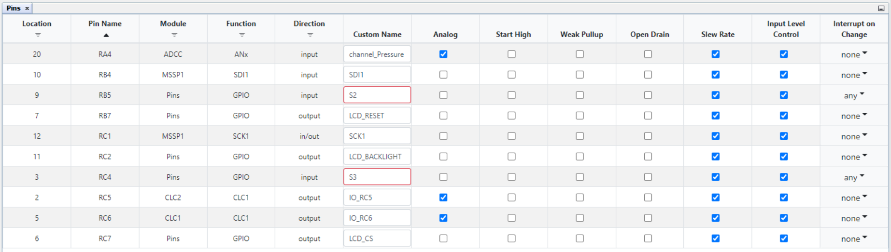
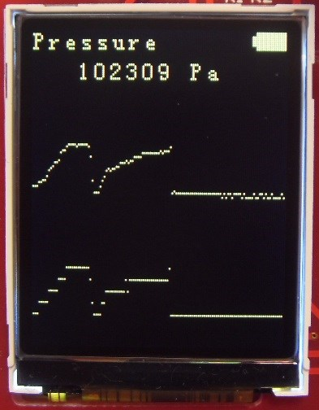
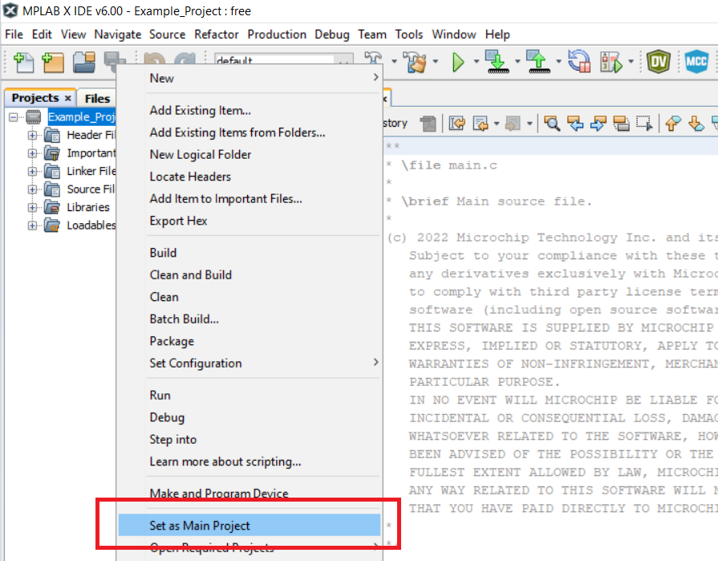
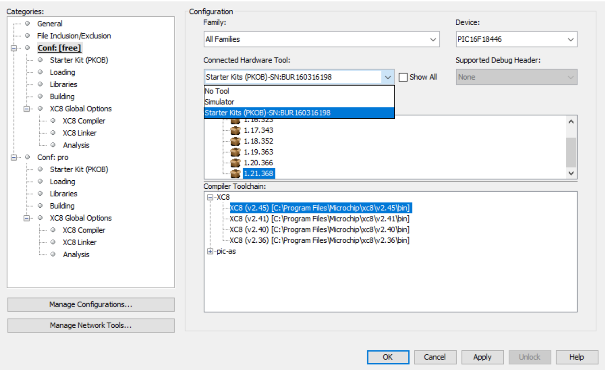

# Sensor Board Pressure Measurement Using the PIC16F18446 Microcontroller

The PIC16F184xx family has a new Analog-to-Digital Converter with Computation (ADCC) with a 12-bit resolution. This project shows the reading of an analog pressure sensor (MP3V5050GP) using the ADCC.
In this example the pressure sensor value is read and the current atmospheric pressure in Pascal units is displayed on the on-board LCD. Two graphs will show the variations of the 12-bit and 10-bit pressure values in real time.

## Related Documentation
- [PIC16F18446 Product Family Page](https://www.microchip.com/design-centers/8-bit/pic-mcus/device-selection/pic16f18446)
- [PIC16F18446 datasheet](http://ww1.microchip.com/downloads/en/DeviceDoc/40001985B.pdf) for more information.

## Software Used

- [MPLAB® X IDE](http://www.microchip.com/mplab/mplab-x-ide) v6.15 or newer
- [MPLAB® XC8](http://www.microchip.com/mplab/compilers) v2.45 or newer
- [MPLAB® Code Configurator (MCC)](https://microchip.com/mplab/mplab-code-configurator) v5.3.7
- [PIC16F1xxxx_DFP](https://packs.download.microchip.com/) v1.21.368

## Hardware Used

- [PIC16F18446 Sensor Board](https://ww1.microchip.com/downloads/en/DeviceDoc/30010172A.pdf)
 

## Operation

To program the microcontroller with this MPLAB® X project, follow the steps provided in the [How to Program the Microcontroller](#how-to-program-the-microcontroller) chapter.  

## Setup
Pressure sensor:

 

The following configurations must be made for this project:

- Clock Control:
  - Clock Source: HFINTOSC
  - HF Internal Clock: 32 MHz
  - Clock Divider: 1

   

- Configuration bits:
  - External Oscillator Selection: Oscillator not enabled
  - Reset Oscillator Selection: HFINTOSC (1 MHz)

   

- MSSP:
  - Serial Protocol: SPI
  - Mode: Host
  - SPI Mode: SPI Mode 0
  - Input Data Sampled At: Middle
  - Clock Source Selection: FOSC/4 

   

- CLC:
  - Enable CLC: Yes
  - Operating Mode: AND-OR 

   
   

- FVR:
 FVR is used as a positive reference for the ADCC to get higher accuracy and gain.
  - Enable FVR: Yes
  - FVR buffer gain to ADC: 1x
  - FVR buffer gain to other peripherals: 1x

   

- ADCC:
  - Enable ADC: Yes
  - Operating Mode: Burst_average_mode
  - Result Alignment: Right
  - Positive Input Channel: ANA4
  - Positive Reference: FVR
  - Negative Reference: VSS
  - Auto-conversion Trigger: Disabled
  - Acquisition Count: 0
  - Clock Source: FOSC
  - Clock Divider: FOSC/128
  - Repeat: 64

   
   

  <i>Repeat</i> is set to 64 to average a burst of 64 samples.

- PIN_Grid
   

- PIN_Module
   

## Demo

Board setup:

   

## Summary

This code exemple shows the reading of an analog pressure sensor using the ADCC peripheral.

## How to Program the Microcontroller

This chapter demonstrates how to use the MPLAB X IDE to program a PIC® device with an `Example_Project.X`. This applies to other projects.

1.  Connect the Curiosity Development board to the PC.

2.  Open the `Example_Project.X` project in MPLAB X IDE.

3.  Set the `Example_Project.X` project as main project.
     Right click the project in the **Projects** tab and then Set as Main Project.
     

4.  Clean and build the `Example_Project.X` project.
     Right click the `Example_Project.X` project and select Clean and Build.
     

5.  Select Starter Kits (PKOB) in the Connected Hardware Tool section of the project settings:
     Right click the project and **Properties**.
     Click the arrow under the Connected Hardware Tool, and from the dropdown, select Starter Kits (PKOB) by clicking the SN.
     Click **Apply** and then **OK**.
     

6.  Program the project to the microcontroller.
     Right click the project and then Make and Program Device.
     

 

- [Back to Top](#sensor-board-pressure-measurement-using-the-pic16f18446-microcontroller)
- [Back to Setup](#setup)
- [Back to Demo](#demo)
- [Back to Summary](#summary)