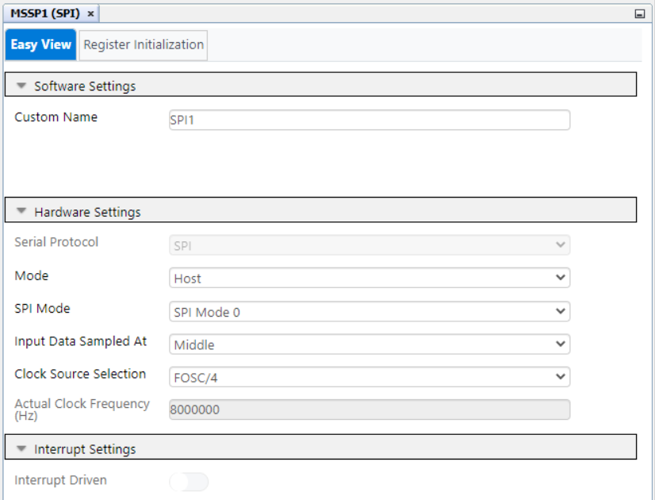
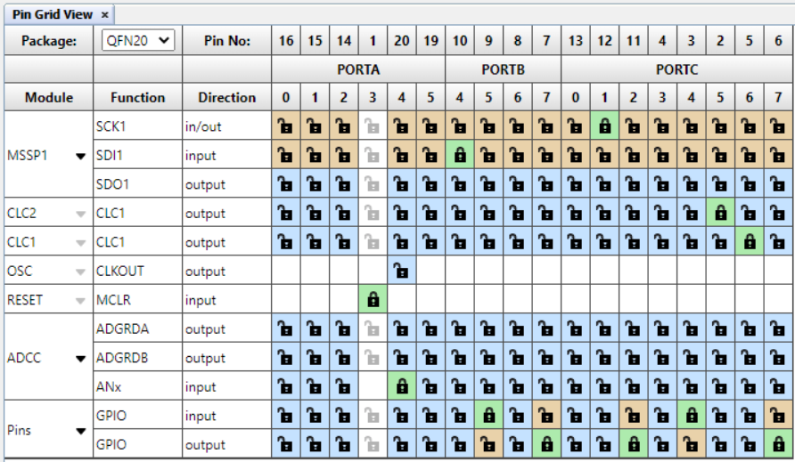

# PIC16F18446 Sensor Board Pressure Measurement

The PIC16F184xx family has a new Analog to Digital Converter with Computation (ADCC) with a 12-bit resolution. This project shows the reading of an analog pressure sensor (MP3V5050GP) using the ADCC.
In this example the pressure sensor value is read and the current atmospheric pressure in Pascal units is displaied on the on-board LCD. Two graphs will show the variations of the 12-bit and 10-bit pressure values in real time.

## Software Used
- MPLAB® X IDE 5.30 or newer [(microchip.com/mplab/mplab-x-ide)](http://www.microchip.com/mplab/mplab-x-ide)
- MPLAB® XC8 2.10 or a newer compiler [(microchip.com/mplab/compilers)](http://www.microchip.com/mplab/compilers)
- MPLAB® Code Configurator (MCC) 3.95.0 or newer [(microchip.com/mplab/mplab-code-configurator)](https://www.microchip.com/mplab/mplab-code-configurator)
- MPLAB® Code Configurator (MCC) Device Libraries 8-bit AVR MCUs 2.3.0 or newer [(microchip.com/mplab/mplab-code-configurator)](https://www.microchip.com/mplab/mplab-code-configurator)
- PIC16F1xxxx DFP 1.2.99 or newer Device Pack

## Hardware Used
- [PIC16F18446 Sensor Board Demonstration](https://www.microchip.com/promo/pic16f18446-sensor-board-demonstration)

## Setup

Pressure sensor:

### MCC settings for MSSP, CLC, FVR, and ADCC. MSSP + CLC are used for the LCD control.

### MSSP Settings

### CCL Settings

### FVR Settings
FVR is used as positive refference for the ADCC, to get higher accuracy and gain.

### ADCC settings

ADRPT register is set to 0x40, to average a burst of 64 samples.

### PIN Grid

### PIN Module

Demo:

