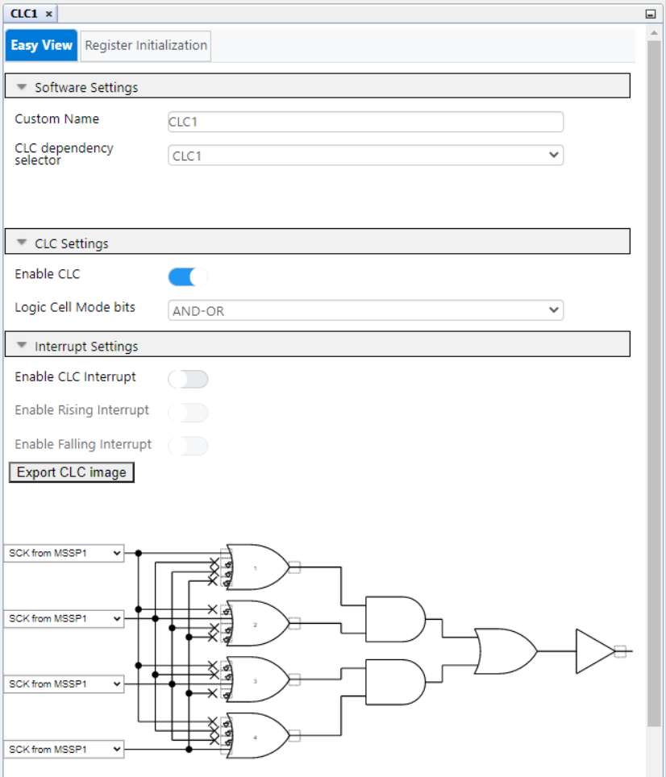

  <article class="markdown-body entry-content p-3 p-md-6" itemprop="text">

# Introduction
The PIC16F184xx family has a new Analog to Digital Converter with Computation (ADCC) with a 12-bit resolution. This project shows the reading of an analog pressure sensor (MP3V5050GP) using the ADCC.

# Description
In this example we will be using the PIC16F18446 Sensor Board. The PIC reads the pressure sensor, and displays the current atmospheric pressure in Pascal units. Also, two graphs display the variations of the 12-bit and 10-bit pressure values in real time.

Here is a picture of the pressure sensor:

# MCC Settings

Here are the settings used for MSSP, CLC, FVR, and ADCC. MSSP + CLC are used for the LCD control.

### MSSP Settings

### CCL Settings

### FVR Settings
FVR is used as positive refference for the ADCC, to get higher accuracy and gain.

### ADCC settings

ADRPT register is set to 0x40, to average a burst of 64 samples.

### PIN Grid

### PIN Module

